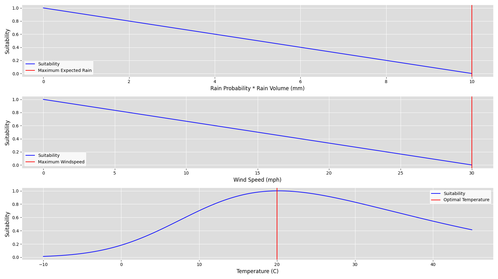

# Cycling Forecaster

# Setup
* `pip3 install requirements.txt`
* Grab your OAuth 2.0 Client IDs `client_secret_XXX.json` for your Google account from https://console.cloud.google.com/apis/credentials (you will need to create a new project) , and place
it into the main directory. This is the account that the forecaster will send emails _from_ and _to_. 
* Sign up for the https://openweathermap.org/ API, and note your API key. 
* *Make sure to set a request limit at OpenWeatherMap, so you are not charged!*

# Tinkering
The `cycling_forecast/constants.py` contains some configuration options to customize your forecasting,
and adjust how various weather attributes are scored. Use `python3 cycling_forecast.py --plot_metrics` to 
view how the suitability scores for wind, temperature, and precipitation, and adjust the constants as desired.

# Usage
To run as a daemon:

`nohup python3 cycling_forecast.py -k ${OPENWEATHER_API_KEY} -e ${EMAIL_ADDRESS} &`

This will continue running, sending a forecast once a day at the specified time. To run just once,
immediately:

`python3 cycling_forecast.py -k ${OPENWEATHER_API_KEY} -e ${EMAIL_ADDRESS} --now`

# Arguments
* `-k, --api_key`: Specify your OpenWeatherMap api key
* `-e, --email`: Specify the email address to send predictions to
* `--plot_metrics`: Plot the suitability metrics across a variety of weather conditions
* `--now`: Run and send the forecast immediately, then quit.

# Default Weather Scoring
Metric scores are computed for rainfall, windspeed, and temperature; these individual
scores are then multiplied together. The plots below show the individual metric components 
for a variety of plausible weather conditions, and the red lines indicate user-configurable parameters.
